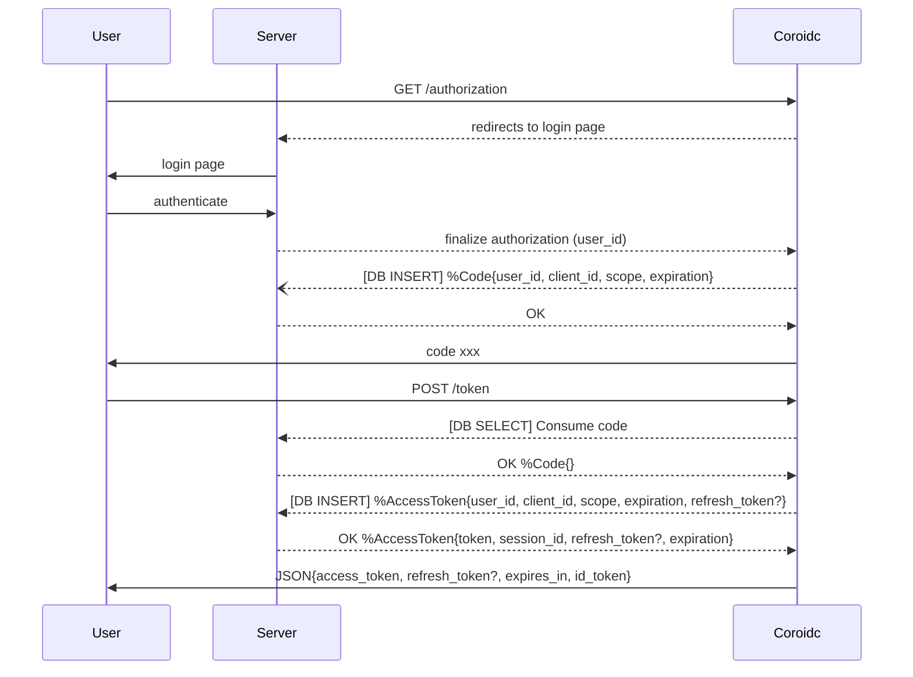

# Flows between user - server - coroidc

## Authorization Code flow

```mermaid
sequenceDiagram
    participant User
    participant Server
    participant Coroidc

    User->>Coroidc: GET /authorization 
    Coroidc-->>Server: redirects to login page
    Server->>User: login page
    User->>Server: authenticate
    Server-->>Coroidc: finalize authorization (user_id)
    Coroidc--)Server: [DB INSERT] %Code{user_id, client_id, scope, expiration}
    Server-->>Coroidc: OK
    Coroidc->>User: code xxx

    User->>Coroidc: POST /token
    Coroidc-->>Server: [DB SELECT] Consume code
    Server-->>Coroidc: OK %Code{}
    Coroidc-->>Server: [DB INSERT] %AccessToken{user_id, client_id, scope, expiration, refresh_token?}
    Server-->>Coroidc: OK %AccessToken{token, session_id, refresh_token?, expiration}
    Coroidc->>User: JSON{access_token, refresh_token?, expires_in, id_token}
```

## JWT flow
to do

## Refresh token flow
to do

## Machine to Machine flow
to do
 